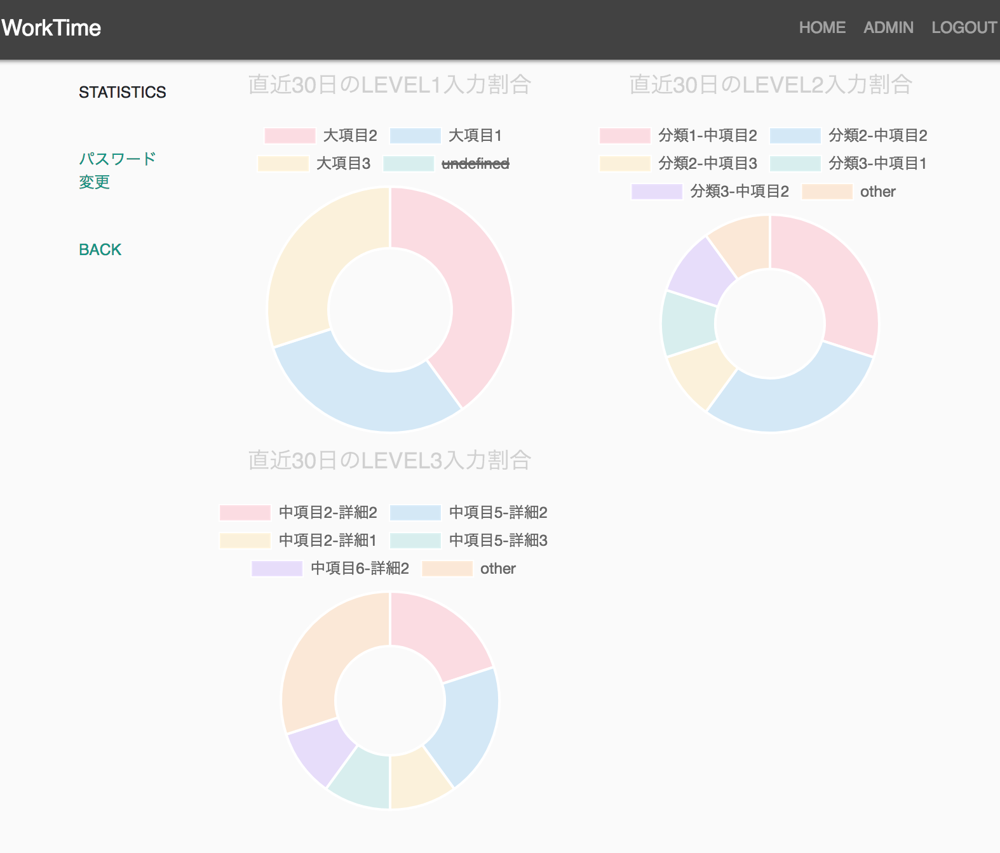

## WorkTimeRecorder
### OverView
---

このアプリケーションは業務の工数管理を目的としたアプリケーションです

### Function
---
* 入力用マスターデータの管理
* ユーザー工数入力
* 統計データ参照

### Setup
---
##### Requirement
* Python 3.6~

```shell
git clone https://github.com/ykomuro0719/worktime2.git
cd worktime2
pip install -r requirements.txt
python manage.py migrate
python manage.py runserver
```
##### Docker
```shell
git clone https://github.com/ykomuro0719/worktime2.git
cd worktime2
docker build -t worktime .
docker run -p 8000:8000 worktime
```

### ScreenShot
---


